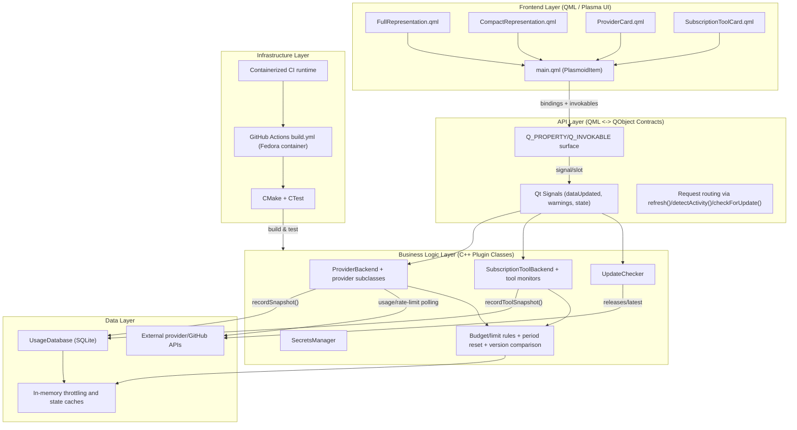
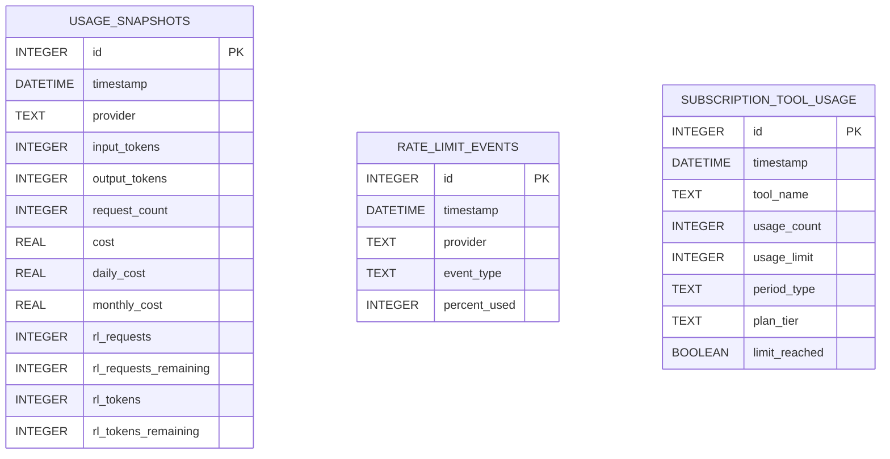
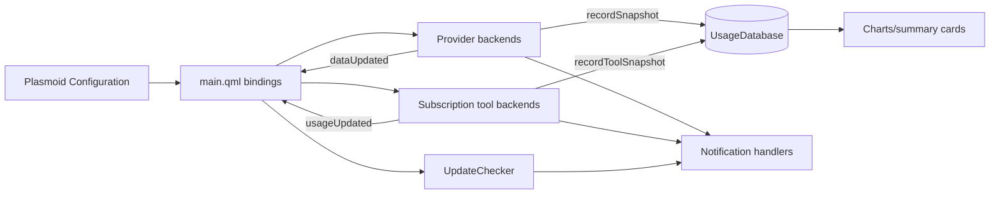

# Implementation Plan: C++ Unit Test Coverage Expansion

## Goal

This feature expands deterministic unit-test coverage for core plugin logic that currently carries the highest regression risk: `ProviderBackend`, `SubscriptionToolBackend`, `UpdateChecker`, and `UsageDatabase`. The implementation keeps test scope pure and local by avoiding network, KWallet, or Plasma runtime dependencies, so tests remain stable in CI and on developer machines. It standardizes test patterns around Qt Test fixtures, minimal concrete subclasses for abstract backends, and isolated temporary data directories. The target outcome is reliable quality gates for business logic updates without introducing new runtime dependencies or changing production behavior.

## Requirements

- Use Qt Test (`QTest`) only, matching existing test stack and CMake/CTest integration.
- Keep tests hermetic: no external network calls, no KWallet daemon dependency, no Plasma session requirement.
- Cover non-network logic paths in:
  - `ProviderBackend` (budget checks, estimation, generation/retry helpers, state/error transitions)
  - `SubscriptionToolBackend` (usage progression, warning thresholds, period reset logic, secondary limits)
  - `UpdateChecker` (version normalization/comparison and property/timer behavior)
  - `UsageDatabase` (retention, export, aggregation, throttling, provider/tool discovery)
- Ensure all tests are automatically discovered by existing `plugin/tests/CMakeLists.txt` and run in GitHub Actions `build.yml`.
- Preserve security constraints: no real API keys, tokens, or user data in fixtures.

### Implementation Plan Specifics

1. Add/maintain one focused test file per class (`test_<classname>.cpp`) with narrow fixture scope.
2. Build minimal concrete test doubles for abstract classes to expose protected logic through public wrappers.
3. Use signal assertions (`QSignalSpy`) for warning/limit/state-change behavior.
4. Validate CI compatibility with the existing workflow:
   - `cmake -S . -B build -DCMAKE_BUILD_TYPE=Debug`
   - `cmake --build build --parallel`
   - `ctest --test-dir build --output-on-failure`

## Technical Considerations

### System Architecture Overview



- **Technology Stack Selection**
  - Frontend: Qt Quick + Kirigami/Plasma components (already in production).
  - API layer: QObject properties/invokables and Qt signals (no internal HTTP API layer in this desktop architecture).
  - Business logic: C++20 + Qt6 (`Core`, `Network`, `Sql`), KF6 integration.
  - Data: SQLite via `QSqlDatabase` with WAL mode and targeted indexes.
  - Infrastructure: CMake/CTest, GitHub Actions Fedora container, clang-tidy gate.
- **Integration Points**
  - QML only talks to registered plugin types (`qmlRegisterType`/`qmlRegisterUncreatableType`).
  - Business logic persists telemetry through `UsageDatabase` invokables.
  - External API I/O stays encapsulated in provider/update classes; unit tests isolate non-network paths.
- **Deployment Architecture**
  - No new deployable service; tests are compiled into CTest executables within existing plugin build.
  - CI continues running in containerized Fedora image with current dependency set.
- **Scalability Considerations**
  - Horizontal: test suite can be partitioned by executable in future matrix jobs.
  - Vertical: low memory footprint by using local fixtures and temporary databases.
  - Runtime impact: none, because changes are test-only.

### Database Schema Design



- **Table Specifications**
  - `usage_snapshots`: provider usage and rate-limit state per refresh cycle.
  - `rate_limit_events`: warning/critical events for notification and analysis.
  - `subscription_tool_usage`: subscription tool usage snapshots and limit state.
- **Indexing Strategy**
  - `idx_snapshots_provider_time(provider, timestamp)` for chart and range queries.
  - `idx_ratelimit_provider_time(provider, timestamp)` for event lookups.
  - `idx_tool_usage_name_time(tool_name, timestamp)` for tool trend views.
- **Foreign Key Relationships**
  - Current schema intentionally uses logical relationships (shared provider/tool identifiers) without strict FK constraints to keep writes simple and backward-compatible.
- **Database Migration Strategy**
  - Maintain additive, non-breaking migrations (`CREATE TABLE/INDEX IF NOT EXISTS` pattern).
  - If schema changes are required later, introduce explicit migration versions using `PRAGMA user_version` and forward-only migration scripts.

### API Design

There is no internal REST/tRPC service in this project; the operational API surface is the QML-to-C++ contract exposed through `Q_PROPERTY`, `Q_INVOKABLE`, and Qt signals.

#### Contract Endpoints (QML Invokables)

| Contract | Input (Type) | Output | AuthN/AuthZ | Error Surface |
|---|---|---|---|---|
| `ProviderBackend.refresh()` | none | async signal updates | API key from KWallet-backed config | `errorChanged`, connection signals |
| `SubscriptionToolBackend.incrementUsage()` | none | usage counters/signals | local only | signal-based warnings/limits |
| `UpdateChecker.checkForUpdate()` | none | `updateAvailable(latestVersion, releaseUrl)` | unauthenticated GitHub API read | `checkingChanged`, qWarning logs |
| `UsageDatabase.recordSnapshot(...)` | provider snapshot payload | void | local-only | guarded by enable/init checks |
| `UsageDatabase.getSummary(provider, from, to)` | query args | `QVariantMap` summary | local-only | empty map on no data |

#### Type Contracts (TypeScript-style reference types for docs/tests)

```ts
type ProviderSnapshotRequest = {
  provider: string;
  inputTokens: number;
  outputTokens: number;
  requestCount: number;
  cost: number;
  dailyCost: number;
  monthlyCost: number;
  rlRequests: number;
  rlRequestsRemaining: number;
  rlTokens: number;
  rlTokensRemaining: number;
};

type ProviderSummaryResponse = {
  totalCost: number;
  avgDailyCost: number;
  maxDailyCost: number;
  totalRequests: number;
  peakTokenUsage: number;
  snapshotCount: number;
};

type ToolSnapshotRequest = {
  toolName: string;
  usageCount: number;
  usageLimit: number;
  periodType: "FiveHour" | "Daily" | "Weekly" | "Monthly";
  planTier: string;
  limitReached: boolean;
};
```

- **Authentication and authorization**
  - Local widget has no multi-user auth layer; provider secrets are retrieved from KWallet.
  - GitHub token usage (Copilot monitor paths) remains opt-in and user-supplied.
- **Error handling strategies**
  - Network failures remain explicit via error properties/signals.
  - Retry policy for provider HTTP paths uses bounded exponential backoff.
- **Rate limiting and caching**
  - Provider layer parses rate-limit headers and emits warning thresholds.
  - Database layer throttles writes per provider to reduce churn.

### Frontend Architecture

#### Component Hierarchy Documentation

```
PlasmoidItem (package/contents/ui/main.qml)
├── SecretsManager (KWallet bridge)
├── UsageDatabase (history persistence)
├── Provider Backends
│   ├── OpenAIProvider
│   ├── AnthropicProvider
│   ├── GoogleProvider
│   ├── MistralProvider
│   ├── DeepSeekProvider
│   ├── GroqProvider
│   └── XAIProvider
├── Subscription Tool Monitors
│   ├── ClaudeCodeMonitor
│   ├── CodexCliMonitor
│   └── CopilotMonitor
├── BrowserCookieExtractor + Browser Sync Timer
├── UpdateChecker
├── CompactRepresentation
└── FullRepresentation
    ├── ProviderCard
    ├── SubscriptionToolCard
    ├── UsageChart / MultiSeriesChart
    └── CostSummaryCard / TrendSummary
```

- **Reusable component library specifications**
  - Plasma/Kirigami primitives for UI consistency.
  - Shared card/chart components for provider/tool rendering.
- **State management patterns**
  - Declarative QML bindings to QObject properties.
  - Event-driven updates via Qt signals (`dataUpdated`, `usageUpdated`, warning/reconnect signals).
  - Timer-based polling and periodic browser-sync triggers.

#### State Flow Diagram



- **TypeScript interfaces and types**
  - Use the reference contracts above as canonical fixture payload shapes for test data generation/documentation.

## Security & Performance

- **Authentication/authorization requirements**
  - Keep all secrets out of source and tests; use fake tokens in fixtures only.
  - Preserve KWallet-managed key access paths without introducing alternate secret stores.
- **Data validation and sanitization**
  - Validate boundary inputs in tests (budget percentages, usage limits, retention day clamping).
  - Continue enforcing URL safety warnings in UI for non-HTTPS custom base URLs.
- **Performance optimization strategies**
  - Keep unit tests deterministic and sub-second where possible.
  - Reuse `QTemporaryDir` and targeted fixture setup to reduce setup overhead.
- **Caching mechanisms**
  - Retain provider write throttling (`WRITE_THROTTLE_SECS`) and in-memory last-value caches.
  - Preserve SQLite WAL mode for write/read concurrency.

## Implementation Phases and Dependencies

1. **Phase 1: Provider backend unit tests**
   - Add/verify budget thresholds, dedup alerts, cost estimation, generation handling, retryable status coverage.
2. **Phase 2: Subscription tool backend unit tests**
   - Add/verify limit warnings, period end calculations, reset logic, secondary usage behavior.
3. **Phase 3: Update checker unit tests**
   - Add/verify version normalization, interval clamping, state/signal semantics.
4. **Phase 4: Usage database extended unit tests**
   - Add/verify prune, export, aggregation, and write-throttle behavior.
5. **Phase 5: CI validation and documentation**
   - Ensure tests are registered/discovered and pass in local + GitHub Actions workflows.

Dependencies:
- Phases 1-4 can run in parallel for implementation, but all must complete before Phase 5 quality-gate validation.
- All phases depend on current CMake/Qt test infrastructure remaining unchanged.

## Quality Gates

- **Gate 1: Build succeeds with tests enabled**
  - `cmake -S . -B build -DCMAKE_BUILD_TYPE=Debug`
  - `cmake --build build --parallel`
- **Gate 2: Full CTest pass**
  - `ctest --test-dir build --output-on-failure`
- **Gate 3: CI workflow pass**
  - `.github/workflows/build.yml` build, clang-tidy, and test steps succeed.
- **Gate 4: No behavior drift**
  - Production plugin runtime behavior remains unchanged (test-only scope).

## Risks and Mitigations

- **Risk:** Abstract class internals are protected/private, increasing test scaffolding complexity.  
  **Mitigation:** Use minimal concrete subclasses with explicit wrapper methods only where required.
- **Risk:** Time-based logic can become flaky.  
  **Mitigation:** Use fixed timestamps and controlled period boundaries in fixtures.
- **Risk:** CI false negatives from environment drift.  
  **Mitigation:** Keep tests free of network and external service dependencies.

## Rollout and Verification

- Merge as test/documentation-only change set.
- Run local and CI quality gates before release packaging.
- Monitor subsequent PRs for reduced regressions in provider/subscription/history logic.
